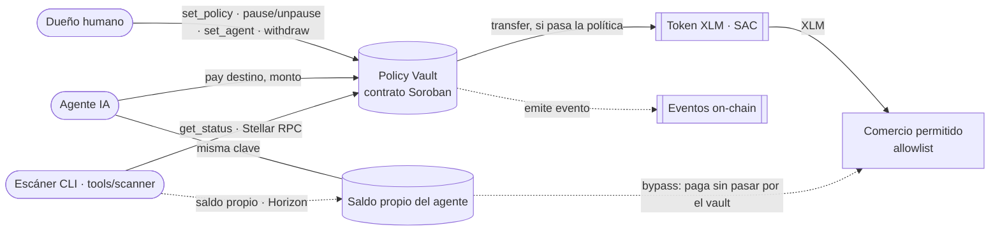
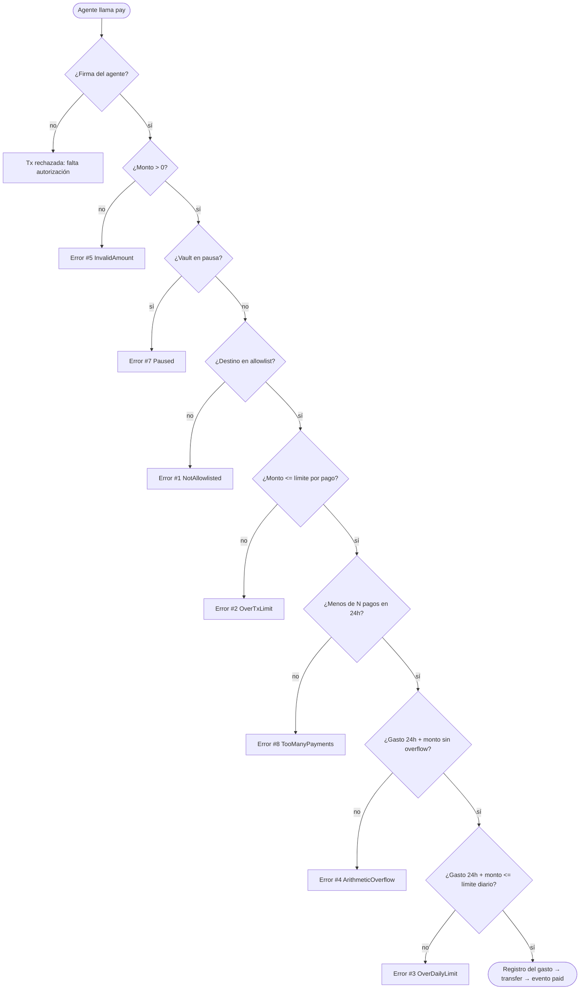

# CrimsonSentry — Arquitectura

Esquema del contrato `policy-vault` (Días 1–2, terminado y probado: 18 tests, `cargo scout-audit` sin hallazgos críticos).

## Actores y componentes

## Flujo de validación de `pay()` (en el orden exacto del código)

Cualquier error hace `panic_with_error!` y **revierte toda la transacción**: no se registra el gasto ni se mueve dinero.

## Opción A (en construcción) vs Opción B (objetivo)

| | Opción A — actual | Opción B — objetivo |
|---|---|---|
| Custodia de fondos | El vault retiene el dinero | La wallet del agente, convertida en *contract account* |
| Enforcement | Lógica del contrato en `pay()` | `__check_auth()` en cada firma |
| Compatible con x402 / MPP | ❌ (firman fuera del vault) | ✅ |
| Punto débil conocido | Si el agente tiene saldo propio, puede evadir el vault | — |

Ese punto débil de la Opción A es justo lo que detecta el escáner (`tools/scanner`, chequeos C1 y C10): lee `get_status()` del vault vía Stellar RPC y el saldo propio del agente vía Horizon. Sobre el vault principal da 🔴 en C1, porque la cuenta del agente conserva sus XLM de Friendbot.
