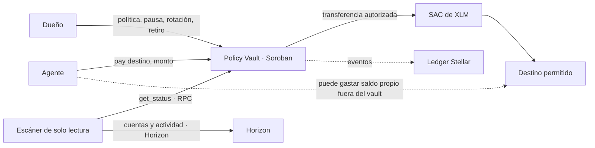

# Arquitectura

CrimsonSentry implementa una custodia programable para pagos de agentes en Stellar. El dueño configura el vault y conserva las acciones administrativas; el agente solo puede solicitar pagos que el contrato autoriza según una política almacenada on-chain.

## Componentes y límites de confianza

```mermaid
flowchart LR
    Owner[Dueño] -->|política, pausa, rotación, retiro| Vault[Policy Vault · Soroban]
    Agent[Agente] -->|pay destino, monto| Vault
    Vault -->|transferencia autorizada| Token[SAC de XLM]
    Token --> Merchant[Destino permitido]
    Vault -.->|eventos| Ledger[Ledger Stellar]
    Scanner[Escáner de solo lectura] -->|get_status · RPC| Vault
    Scanner -->|cuentas y actividad · Horizon| Horizon[Horizon]
    Agent -.->|puede gastar saldo propio fuera del vault| Merchant
```

El contrato constituye el límite de confianza para los fondos depositados en él. La clave del agente y la información observada por el escáner quedan fuera de ese límite. Horizon permite detectar parte de la actividad, pero no puede impedir que una cuenta con saldo propio pague directamente.

## Flujo de un pago

1. `pay` exige la autorización de la dirección de agente configurada.
2. Rechaza montos no positivos y pagos mientras el vault esté pausado.
3. Comprueba que el destino esté permitido y que se respeten el límite por pago, el máximo de operaciones y el límite de gasto de las últimas 24 horas.
4. Registra el pago en el log persistente y transfiere el activo desde el contrato.
5. Emite el evento `paid`.

La transferencia y la actualización del log forman parte de la misma transacción Stellar: si falla cualquier paso, el ledger revierte toda la operación. La ventana es móvil; una entrada deja de contar al cumplirse 24 horas desde su timestamp.

## Estado y límites de recursos

- El dueño, el agente, el token, la política y la pausa se guardan como estado de instancia.
- El log de pagos se guarda en almacenamiento persistente y se poda al procesar un pago nuevo.
- La allowlist está limitada a 32 destinos.
- La política limita los pagos a 100 por ventana de 24 horas.
- Las entradas antiguas del log están ordenadas por timestamp; el contrato conserva el sufijo vigente.
- El TTL de instancia se amplía al leer o modificar el contrato. El log persistente renueva su TTL cuando se registra un pago.

## Controles administrativos

El dueño puede reemplazar la política, pausar, reanudar, rotar el agente y retirar fondos. La política debe tener límites positivos y coherentes; dueño y agente deben ser distintos, y ninguno de los dos ni el contrato pueden ser destinos pagables. El cambio de dueño requiere una propuesta del dueño actual y aceptación firmada por la nueva dirección. La propuesta se puede cancelar y queda visible mediante `get_pending_owner`. Mientras haya una propuesta, el contrato evita que esa dirección se convierta en agente o destino pagable. `withdraw` sigue disponible en pausa para que el dueño pueda recuperar los fondos.

El contrato no admite actualización de código. Para cambiar la lógica, se debe desplegar una nueva instancia y migrar los fondos mediante el método de retiro.

## Evolución prevista

La implementación actual corresponde al patrón de vault: el agente llama explícitamente a `pay`. No intercepta transferencias firmadas directamente por la cuenta del agente, por lo que no aplica automáticamente a protocolos de pagos que firman desde esa cuenta. La evolución propuesta es una cuenta de contrato con `__check_auth`, acompañada de un diseño específico de autorización, despliegue y recuperación.
